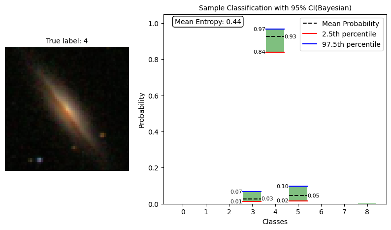
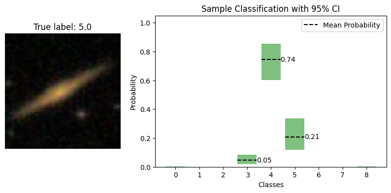
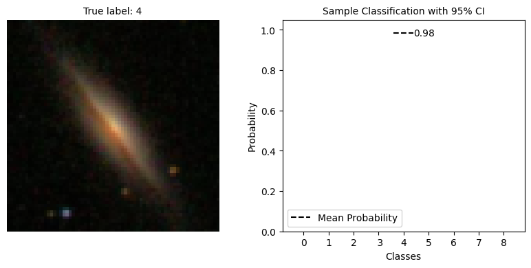
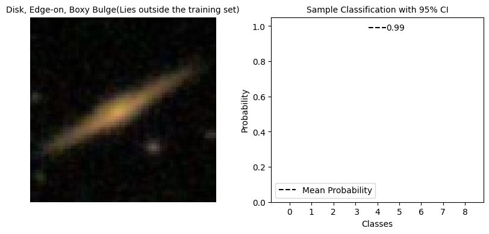

# bayesian_sdss


A Bayesian CNN approach to SDSS image data classfication


# Local installation


```
conda create -n env python=3.7

git clone https://github.com/abhimanyu911/bayesian_sdss.git

pip install -r requirements.txt
```


# Results 


| Model           | Parameters  | Accuracy    | F1-score    |
| --------------- | ----------- | ----------- | ----------- | 
| CNN(frequentist)| 149K        | 0.82        | 0.81        | 
| CNN(Bayesian)   | 174K        | 0.82(0.94)  | 0.81(0.94)  |


1. By introducing ensembling and a rejection threshold, the Bayesian CNN achieves a 12% improvement in accuracy(from 82 to 94) and a 13% improvement in F1-score(from 81 to 94). 
2. Using a threshold of 0.95 for the mean probability of each class prediction, the Bayesian CNN classifies 55.83% of the samples in the test set and refuses to classify the rest.
3. Using a plotting mechanism, we can see that while the Bayesian CNN is confident in its prediction for classes present in the training set(eg class 4 in the fig 1 below), it is not confident for classes not present in the training set(eg class 5 in the fig 2 below), as evidenced by the wider confidence interval and lower max probability. This is a desirable property as we do not want the model to make predictions for samples of a class it has not seen before.
4. The Frequentist CNN is confident in its prediction regardless of the class (fig 3 and 4) which is not desirable.











# Note

Kindly maintain tf-gpu/tf as 2.5.0 and tfp as 0.13.0 else you may encounter dependency issues
