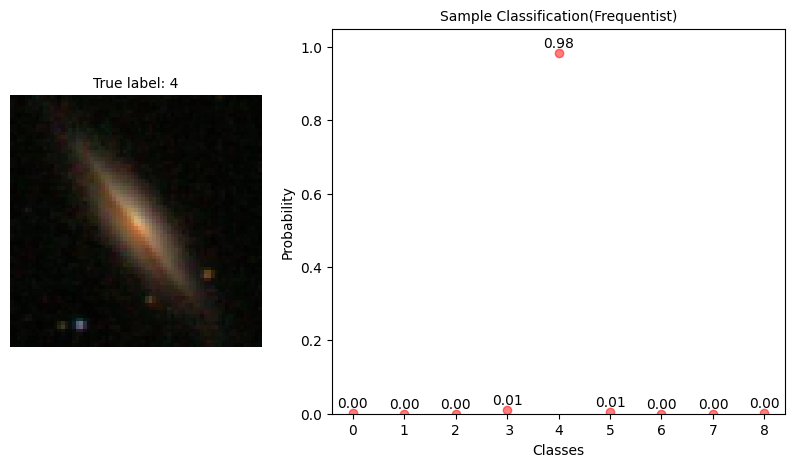
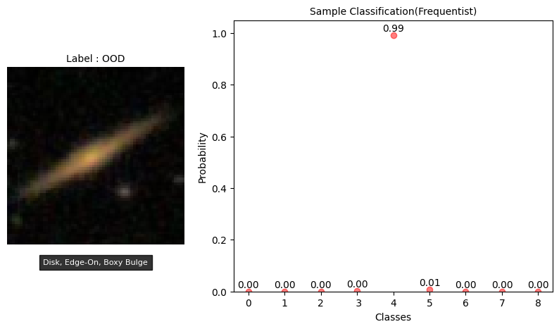

# bayesian_sdss


A Bayesian CNN approach to SDSS image data classfication:

In recent years, the introduction of extensive sky surveys, like the Sloan Digital Sky Survey, has revolutionized astronomical
observations on a grand scale. The extensive data generated by astronomers through sky surveys presents a significant challenge
due to the time-consuming nature of manual classification. In response to this, a volunteer-driven citizen science initiative called
"Galaxy Zoo" was established in 2007, effectively reducing the time required for classification. However, in the current era
of deep learning, the automation of galaxy classification offers substantial benefits by further reducing the classification time.
In recent years, numerous algorithms have been proposed that demonstrate remarkable performance in classifying galaxies
into multiple classes. These advancements in automated classification techniques have revolutionized the field, enabling more
efficient, accurate, and faster classification of galaxies when compared to manual methods. However, none of these methods
account for uncertainty or solve the problem of overconfident predictions. In this study, we propose a Bayesian Convolutional
Neural Network that incorporates entropy to calculate uncertainty. This approach enables us to abstain from making predictions
when the output probabilities exhibit a high degree of randomness.


# Local installation


```
conda create -n env python=3.7

git clone https://github.com/abhimanyu911/bayesian_sdss.git

pip install -r requirements.txt
```


# Results 


1. By introducing ensembling and an entropy based rejection threshold, the Bayesian CNN is able to outperform its frequentist counterpart. 
2. Using an optimal entropy threhsold 0.85 bits for each sample, the Bayesian CNN classifies 73.8% of the samples in the test set and refuses to classify the rest. We also experimented with different thresholds. See [notebook](./sdss_classification.ipynb) for details.
3. Using a plotting mechanism, we can see that while the Bayesian CNN is confident in its prediction for classes present in the training set(eg class 4 in the fig 1 below), it is not confident for classes not present in the training set(eg OOD sample in the fig 2 below), as evidenced by the wider confidence interval, lower max probability and high mean entropy. This is a desirable property as we do not want the model to make predictions for samples of a class it has not seen before.
4. The Frequentist CNN is confident in its prediction regardless of the class (fig 3 and 4) which is not desirable.







# Model architectures


## Frequentist CNN


## Bayesian CNN


# Note

Kindly maintain tf-gpu/tf as 2.5.0 and tfp as 0.13.0 else you may encounter dependency issues
