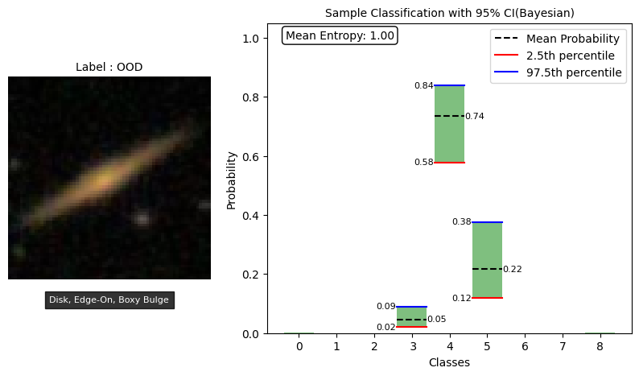

# bayesian_sdss


A Bayesian CNN approach to SDSS image data classfication


# Local installation


```
conda create -n env python=3.7

git clone https://github.com/abhimanyu911/bayesian_sdss.git

pip install -r requirements.txt
```


# Results 


1. By introducing ensembling and an entropy based rejection threshold, the Bayesian CNN is able to outperform its frequentist counterpart. 
2. Using an optimal entropy threhsold 0.85 bits for each sample, the Bayesian CNN classifies 73.8% of the samples in the test set and refuses to classify the rest. We also experimented with different thresholds. See [notebook](./sdss_classification.ipynb) for details.
3. Using a plotting mechanism, we can see that while the Bayesian CNN is confident in its prediction for classes present in the training set(eg class 4 in the fig 1 below), it is not confident for classes not present in the training set(eg OOD sample in the fig 2 below), as evidenced by the wider confidence interval, lower max probability and high mean entropy. This is a desirable property as we do not want the model to make predictions for samples of a class it has not seen before.
4. The Frequentist CNN is confident in its prediction regardless of the class (fig 3 and 4) which is not desirable.





# Model architectures


## Frequentist CNN


## Bayesian CNN


# Note

Kindly maintain tf-gpu/tf as 2.5.0 and tfp as 0.13.0 else you may encounter dependency issues
